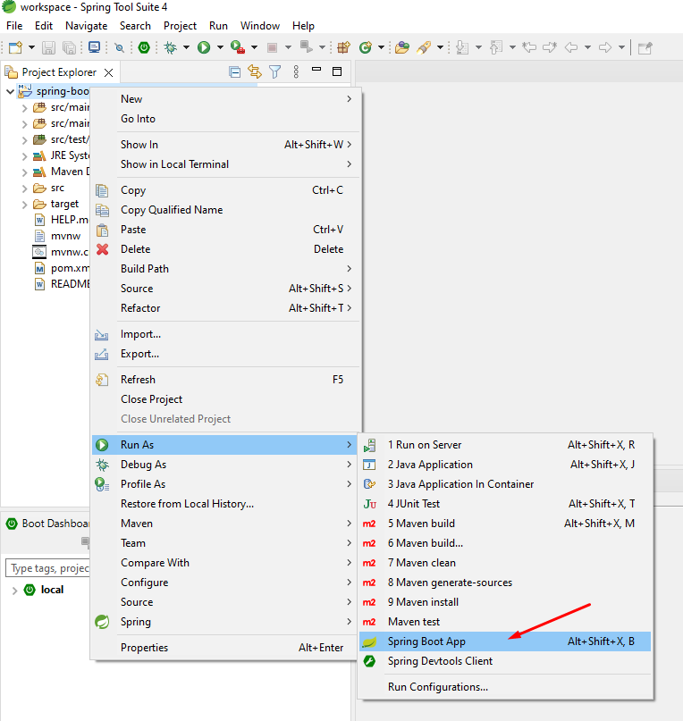
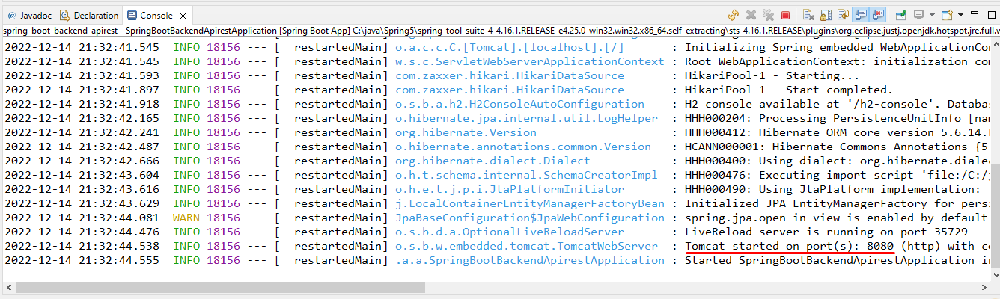
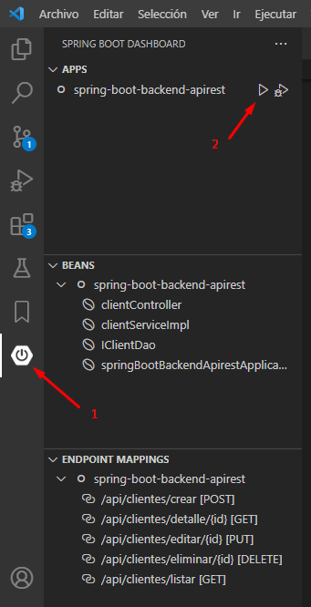
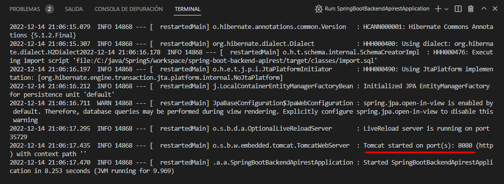

# Spring Boot App Jpa

Este proyecto fue desarrollado con Springboot versión 2.7.5.

Esta web fue creada para simular la creación de facturas asociadas a clientes y también la administración de roles USER y ADMIN

## ¿Qué hace esta web?
***

Simplemente muestra la implementación de un CRUD, lo que, en palabras simples, sirve para obtener información desde una base de datos, poder crear nuevos registros, poder editarlos y también poder eliminarlos. Lo cual son las típicas funciones BASE de toda aplicación, ya sea Web, Escritorio o Mobile.

Además, cuenta con las opciones de poder descargar las facturas en formato PDF y Excel.

Y por último, también contamos con la opción de poder cambiar el idioma de la aplicación completamente entre Inglés y Español.

## Usuarios de acceso a la aplicación.
***

Usuario administrador -> User: admin | Pass: 123456

Usuario simple -> User: izhar | Pass: 123456

## Tecnologías principales usadas
***

* Springboot 2.7.5
* Thymeleaf
* Java
* Data JPA
* H2 Database.
* JavaScript
* Bootstrap
* Sweetalert2

## ¿Como correr esta aplicación?
***

En primer lugar tenemos la opción de ver esta aplicación Web funcionando desde el siguiente enlace: [Spring Boot App Jpa]() 

Otra opción es descargar este código o clonarlo con Git para tenerlo de forma local en nuestro equipo.

## Requisitos para poder hacer despliegue de esta aplicación en tu computador
***

Tener instalado en nuestro equipo las herramientas de Java: JDK o OpenJDK y algún editor o Ide de su preferencia, tales como Eclipse, Visual Studio Code con la extensión de Spring tools o simplemente el IDE Spring Tools (Recomendado).

Enlace a las herramientas necesarias.

* [Java JDK](https://www.oracle.com/java/technologies/downloads/)
* [Java OpenJDK](https://openjdk.org/projects/jdk/19/)
* [Eclipse](https://www.eclipse.org/downloads/)
* [Visual Studio Code](https://code.visualstudio.com/)

En este enlace encontramos el IDE Spring tools y también las extensiones para Eclipse y Visual Studio Code entre otros.
* [Spring Tools](https://spring.io/tools)

## Despliegue de la aplicación
***

Una vez instalado un IDE o editor de código según la preferencia, abrimos el proyecto.

**Casos de ejemplo**

En el caso de usar Spring Tools, al costado izquierdo tendremos el proyecto, hacemos clic derecho en él y seleccionamos Run As -> Spring Boot App.

Posteriormente el proyecto empezará a ejecutarse y aparecerá una consola con lo siguiente.

En el caso de usar Visual Studio Code, al costado izquierdo tendremos el icono de Spring Boot, lo seleccionamos y en la ventana APPS nos aparecerá el nombre del proyecto. simplemente damos clic derecho y seleccionamos 'run' o presionamos el símbolo de Play.

Una vez ejecutado el proyecto aparecerá en consola lo siguiente:

Y como podemos apreciar, nos indica que el proyecto levantó en el puerto 8080, por lo cual, para poder visualizarlo simplemente debemos abrir el enlace de localhost más el puerto en nuestro navegador de preferencia.

Ej. enlace: http://localhost:8080/

## Contacto
***

* [Web](https://ibaezar.herokuapp.com/)
* [LinkedIn](https://www.linkedin.com/in/ibaezar/)
* [Correo](mailto:ibaezar@outlook.com)
* [WhatsApp](https://wa.me/56936330855)